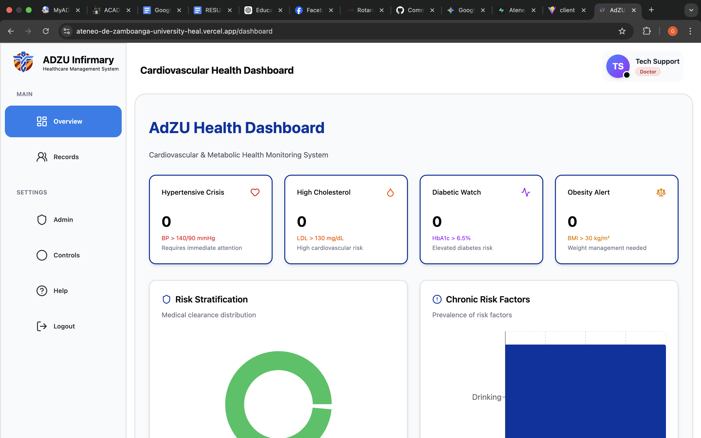
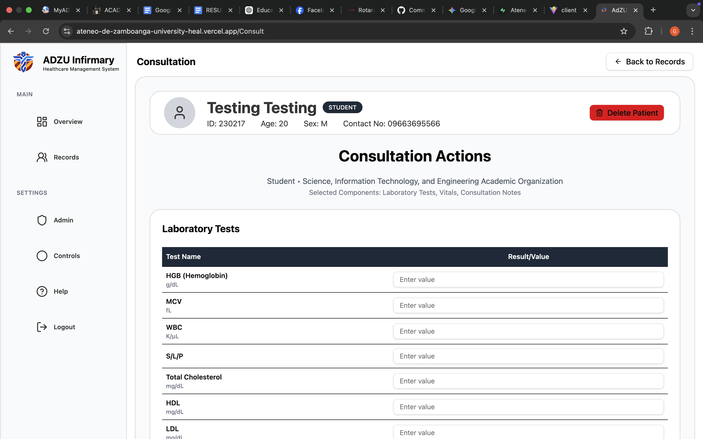

# Ateneo de Zamboanga University Health Management System (UHMS)

A web-based Health Management System for Ateneo de Zamboanga University.  
This project helps manage student health records, consultations, clinical workflows, and role-based access for staff and administrators.

## Overview

UHMS is organized as a monorepo with:

- `client/` - React + Vite frontend application
- `backend/` - Express API backend
- `api/` - deployment-specific API handlers
- `documentation/` - project screenshots and visual references

## Core Features

- Secure login and authentication flow
- Role-based access control (`admin` and standard users)
- Dashboard with health-related summaries and quick views
- Medical records management and profile viewing
- Consultation and clinical workflows
- Admin and controls pages for privileged operations

## Technology Stack

- **Frontend:** React, Vite, React Router, Tailwind CSS
- **Backend:** Node.js, Express
- **Database/Auth Platform:** Supabase

## Getting Started

### Prerequisites

- Node.js `>=18`
- npm
- Supabase project credentials

### Installation

```bash
npm run install:all
```

### Environment Variables

Configure the following variables before running the system:

- Backend (`backend/.env`)
  - `SUPABASE_URL`
  - `SUPABASE_KEY`
  - `PORT` (optional; defaults to `3001`)
  - `NODE_ENV` (optional)

- Frontend (`client/.env`)
  - `VITE_API_URL`
  - `VITE_SUPABASE_URL`
  - `VITE_SUPABASE_ANON_KEY`

### Run in Development

Start the backend:

```bash
npm run dev:backend
```

Start the frontend (in another terminal):

```bash
npm run dev:client
```

## Project Scripts

- `npm run install:all` - install backend and client dependencies
- `npm run dev:backend` - start backend with nodemon
- `npm run dev:client` - start frontend with Vite
- `npm run build` - build frontend for production

## Screenshots and Data Display

The following images from `documentation/` illustrate major screens and data presentation in UHMS:

### Dashboard



### Consultation



### Data Display


### Medical Records


### New Entry


## Notes

- Ensure both frontend and backend environment variables are correctly configured before testing.
- The documentation screenshots are included to provide a visual overview of the system's interface and data presentation.
